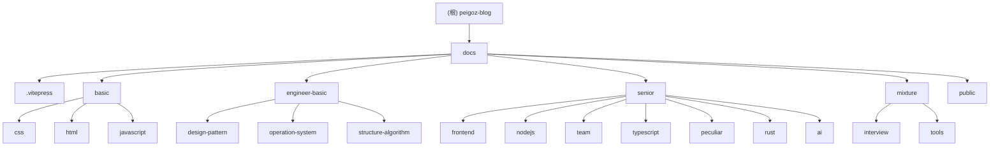

# peigoz-blog 项目 AI 上下文

> 仓库根级 AI 上下文。模块级详情请点击下方模块索引中的链接。

## 项目愿景

**peigoz-blog**（别来无恙）是基于 VitePress 与 `@sugarat/theme` 的个人技术博客，用于沉淀前端、工程、Rust、AI 等领域的学习笔记与面试总结。内容以 Markdown 文章为主体，通过 GitHub Actions 自动构建并部署到 GitHub Pages。

- 站点：<https://peigo.top>
- 源码仓库：<https://github.com/peigoz/peigoz>
- 作者：peigoz（别来无恙）
- 核心价值：低成本维护、目录即结构、纯 Markdown 写作。

## 架构总览

- **站点框架**：VitePress 1.6.3（SSG），根目录 `docs/`。
- **主题**：`@sugarat/theme` 0.5.27 博客主题（含 RSS、pagefind 离线搜索、giscus 评论、mermaid 等能力），在 `docs/.vitepress/theme` 做少量自定义重载。
- **UI 依赖**：Vue 3.4、Element Plus、`xmind-embed-viewer`（XMind 脑图嵌入组件）。
- **包管理**：pnpm（CI 锁定 pnpm 10.34.5），Node 24（volta）。
- **内容组织**：`docs/` 下按 `分类/子分类/文章.md` 三层组织，子目录名经 `dirname-translate.ts` 映射为中文侧边栏标题。
- **动态侧边栏**：`docs/.vitepress/configs/sidebar.ts` 运行时扫描 `docs` 目录生成侧边栏，并将文章顺序写入 `sidebar-cache.ts`。
- **部署**：`.github/workflows/deploy.yml`，push 到 main 即构建并发布 GitHub Pages。

## 模块结构图（Mermaid）



## 模块索引

| 模块 | 路径 | 一句话职责 | 文章/文件数 | 模块文档 |
| ------ | ------ | ----------- | ------------- | ---------- |
| 站点配置与主题 | `docs/.vitepress` | VitePress 主配置、`@sugarat/theme` 主题配置、自定义样式、导航与动态侧边栏生成 | 8 个 TS/MTS + 2 个样式 | [docs/.vitepress/CLAUDE.md](./docs/.vitepress/CLAUDE.md) |
| 前端基础 | `docs/basic` | HTML / CSS / JavaScript 基础知识笔记（css、html、javascript 三个子分类） | 16 篇文章 | [docs/basic/CLAUDE.md](./docs/basic/CLAUDE.md) |
| 工程基础 | `docs/engineer-basic` | 设计模式、操作系统、数据结构与算法 | 8 篇文章 | [docs/engineer-basic/CLAUDE.md](./docs/engineer-basic/CLAUDE.md) |
| 进阶 | `docs/senior` | 大前端、Node.js、团队协作、TypeScript、百宝箱、Rust、AI 七个子分类 | 38 篇文章 | [docs/senior/CLAUDE.md](./docs/senior/CLAUDE.md) |
| 杂项 | `docs/mixture` | 面试系列与工具软件 | 5 篇文章 | [docs/mixture/CLAUDE.md](./docs/mixture/CLAUDE.md) |
| 静态资源 | `docs/public` | favicon、头像、robots、移动端禁用缩放脚本等（随构建原样拷贝） | 6 个文件 | —（由根级管理） |

> 注：`docs/index.md`（首页）与 `docs/about.md`（关于我）为特殊页面，不归属于任何内容分类模块。

## 运行与开发

```bash
# 安装依赖（推荐 pnpm，Node >= 24）
pnpm install

# 本地开发（默认 http://localhost:5173）
pnpm dev

# 生产构建（输出到 docs/.vitepress/dist）
pnpm build

# 本地预览构建产物
pnpm serve
```

- `package.json` 脚本：`dev` / `build` / `serve`，均基于 VitePress 的 `docs` 目录。
- 工具链：`typescript`（仅用于配置/脚本类型）、`sass`（SCSS 样式）、`pagefind`（离线搜索索引）、`oxfmt`（格式化）。

## 测试策略

- 本项目为静态博客站点，**无单元/集成测试**。
- 质量保障方式：
  1. `pnpm build` 成功产出 `docs/.vitepress/dist` 视为构建通过（CI 中即以此为准）。
  2. Markdown 语法与 frontmatter 正确性依赖 VitePress 构建期校验。
  3. 侧边栏生成逻辑在构建时由 `sidebar.ts` 自动执行，异常会直接导致构建失败。
- 建议：新增/修改文章后至少本地执行一次 `pnpm build` 验证。

## 编码规范

- **文章 frontmatter**（必需）：`title`（标题）、`date`（`YYYY-MM-DD HH:MM:SS`）、`tags`（数组）、`publish: true`。
  - 可选：`isShowComments`（false 关闭评论）、`hidden`（true 隐藏于列表，如 about.md）。
- **目录规范**：`docs/<分类>/<子分类>/<文章名>.md`，子分类目录名必须出现在 `dirname-translate.ts` 映射表中，否则侧边栏显示英文目录名。
- **写作格式**：VitePress 默认 Markdown 语法；支持 `::: tip` / `::: warning` 等容器、代码块高亮、`fmTitlePlugin`（frontmatter 标题插件）。
- **配置/脚本**：TypeScript 风格，`config.mts` / `configs/*.ts`，ESM 导入；格式化使用 `oxfmt`。
- **忽略清单**：`.gitignore` 含 `node_modules`、`dist`、`cache`、`.temp`、`.obsidian`、`.vscode` 等。注意 `docs/.vitepress/dist` 为构建产物，不应手工编辑。

## AI 使用指引

1. **写文章**：在对应分类目录新建 `.md`，补齐 frontmatter（title/date/tags/publish），正文遵循 VitePress Markdown；如需关闭评论加 `isShowComments: false`。
2. **新增子分类**：创建目录 → 添加文章 → 在 `dirname-translate.ts` 注册中文名 → 必要时更新 `nav.ts` 导航。
3. **改主题/样式**：优先改 `docs/.vitepress/theme/style.scss`（自定义样式重载已启用）；`user-theme.css` 默认被注释（未启用）。
4. **改站点全局配置**：`docs/.vitepress/config.mts`（导航、图标、sitemap、语言等）；`docs/.vitepress/blog-theme.ts`（评论、页脚、主题色、友链等 `@sugarat/theme` 专属项）。
5. **侧边栏顺序调整**：直接编辑 `sidebar-cache.ts` 中对应目录数组，或改动后运行构建让其自动重写（`sidebar.ts` 会重写该文件）。
6. **注意**：`docs/.vitepress/dist` 为构建产物，禁止手工改动；`node_modules` 勿动。

## 变更记录 (Changelog)

- **2026-08-27**：首次初始化项目 AI 上下文。生成根级 `CLAUDE.md`、5 个模块级 `CLAUDE.md`（`.vitepress`、`basic`、`engineer-basic`、`senior`、`mixture`）与 `.claude/index.json`；新增模块结构 Mermaid 图与各模块导航面包屑。
